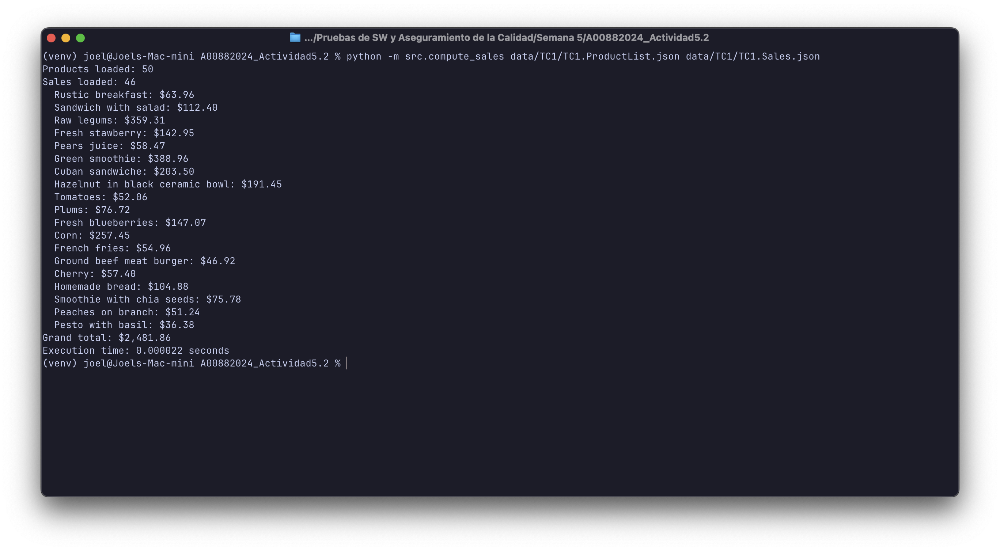
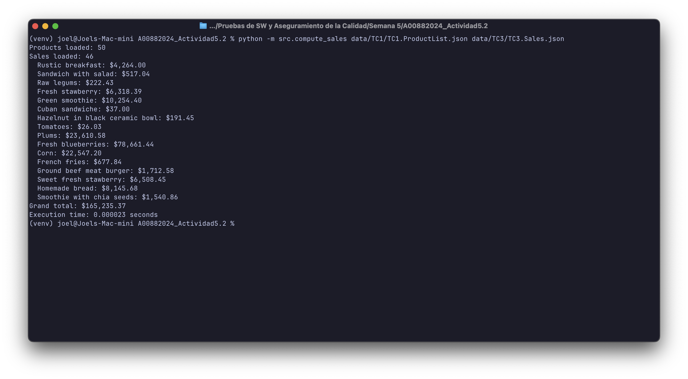

# Pruebas de SW y Aseguramiento de la Calidad

## Actividad 5.2: Ejercicio de programación 2

**Student:** Joel Garcia Martinez
**Student ID:** A00882024

---

## Setup

### Prerequisites

- Python 3.x

### Installation

1. Clone the repository:

```bash
git clone git@github.com:a00882024/A00882024_Actividad5.2.git
cd A00882024_Actividad5.2
```

2. Create and activate a virtual environment:

```bash
python -m venv venv
source venv/bin/activate
```

3. Install dependencies:

```bash
pip install -r requirements.txt
```

## Usage

```bash
python -m src.compute_sales priceCatalogue.json salesRecord.json
```

Results are printed to the console and saved to `results/SalesResults.txt`.

## Running Tests

```bash
pytest
```

## Linting

```bash
flake8 src/ tests/
```

## Results

Grand total comparison between the expected values (`data/Results.txt`) and our computed output (`results/`):

| Test Case | Expected | Computed | Match |
|-----------|----------|----------|-------|
| TC1 | $2,481.86 | $2,481.86 | Yes |
| TC2 | $166,568.23 | $166,568.23 | Yes |
| TC3 | $165,235.37 | $165,235.37 | Yes |

### Execution Screenshots

**TC1**


**TC2**


**TC3**


## Architecture

```
                         +---------------------+
                         |   compute_sales.py  |
                         |     (CLI entry)     |
                         +---------------------+
                            |              |
                   reads JSON        reads JSON
                            |              |
                            v              v
              +-------------------+  +------------------+
              | ProductRepository |  | SalesRepository  |
              |-------------------|  |------------------|
              | from_json()       |  | from_json()      |
              | get(title)        |  | __iter__()       |
              | validates:        |  | validates:       |
              |  - title exists   |  |  - Product exists|
              |  - price numeric  |  |  - Quantity num. |
              +-------------------+  +------------------+
                            \              /
                             \            /
                              v          v
                        +-------------------+
                        |   SalesComputer   |
                        |-------------------|
                        | compute()         |
                        | save_to_file()    |
                        +-------------------+
                                 |
                    +------------+------------+
                    |                         |
                    v                         v
              +-----------+        +--------------------+
              |  Console  |        | SalesResults.txt   |
              +-----------+        +--------------------+
```

## Design Decisions

### Repository Pattern (`ProductRepository`, `SalesRepository`)

Data loading and access are encapsulated in dedicated repository classes rather than handled inline in the main script. This provides three benefits:

1. **Single Responsibility** — Each repository owns the logic for loading, validating, and querying one data source. The rest of the codebase never deals with raw JSON or file I/O for that data.
2. **Testability** — Repositories can be instantiated from plain Python lists in tests, without touching the filesystem. This keeps tests fast and focused.
3. **Validation at the boundary** — Invalid records (missing fields, wrong types) are caught once during construction and logged with clear warnings, so downstream code can trust the data it receives.

### Computation Module (`SalesComputer`)

Business logic is isolated in `SalesComputer` instead of living inside the CLI entry point. This separation means:

1. **Independence from I/O** — `SalesComputer` receives repository objects and returns a plain dict. It has no knowledge of files, command-line arguments, or output formatting.
2. **Easy to test** — Unit tests verify computation results directly without invoking the CLI or mocking `sys.argv`.
3. **Reusability** — The same computation can be called from a different entry point (e.g., a web API or batch job) without duplicating logic.
